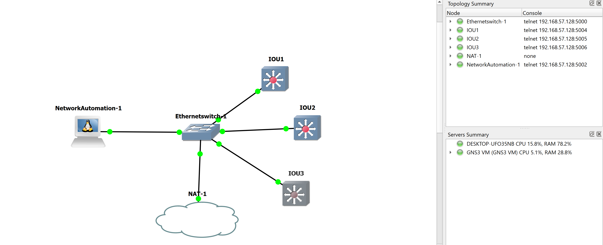

# NetworkChallengeMeLi

Dada una infraestructura LAN con equipos Switches Cisco, se genera Script en lenguaje python para que realice backups
de configuraciones sobre los equipos guardando los mismos de forma centralizada en directorios. Se debera generar 5 scripts diarios,
1 script semanal y un script mensual. 

Herramientas Utilizadas:
- Lenguaje Python 2.7
- GNS3
- Docker Network_Automation 

Se procede a pensar la siguente solucion al problema teniendo en cuenta la periodicidad y un script para realizar un descubrimiento
de la red en busca de nuevos equipos conectados.
 

Desde el script menu.py se va a poder seleccionar la periodicidad deseada de backup, y desde el script discovery.py se va a poder generar un archivo llamado Iplist con todas las conexiones activas de la red.
El proceso de descubrir se ejecuta de la siguente manera: #python discovery.py subnet
                                             por ejemplo: #python discovery.py 192.168.122.0/24  

Se crea la topologia de pruebas en GNS3 utilizando el docker Network_Automation Appliance
 - https://docs.gns3.com/appliances/network_automation.html

Se elige este docker ya que el mismo posee entre otras la libreria NETMIKO que es utilizada para redes.
 - https://pynet.twb-tech.com/blog/automation/netmiko.html
 - https://github.com/ktbyers/netmiko 

Como solucion a la hora de guardar los archivos se genero un directorio principal, y dentro, se genera otro directorio
por equipo para guardar su correspondiente backup, por ejemplo ConfiguracionesDeSwitches/IP/backup.txt 

Se crea para testear la siguente topologia:
 
 
 En la siguente topologia se agregan 3 equipos con IOU Cisco, con IP fija y SSH activo y el Docker con ip DHCP,
 Dentro del contenedor Docker se generan los scripts, primero probando la conexion a los equipos mediante PING a los Switches, luego procedi
 a probar la conexion Telnet y SSH.
 
 Luego ejecuto desde el menu.py los scripts:
 Username: cisco
 Password:
 1. Realizar backup diario de 5 archivos
 2. Realizar backup semanal de 1 archivo los dias Domingos
 3. Realizar backup mensual de 1 archivo el primer dia del mes
 4. Salir
 Seleccione una opcion
 Introduce un numero entero:
 
 **Se procede al logueo primeramente, si no se ponen las correctas credenciales, se va a generar un error de autenticacion
 al momento de querer realizar algun tipo de backup.
 
 Una vez finalizado el backup se podra ingresar al directorio en busca de los achivos con la configuraciones de cada equipo.
 
Conclusion: Los archivos backups se pueden guardar donde corresponden y es bueno tener backups actualizados en caso de necesitarlos. 
Opinion de mejora de tiempos. Como aclaracion se podria ejecutar utilizando el concepto de thread(hilos), con esto
se podrian mejorar los tiempos de generacion de backups, ya que se conectaria paralelamente a todos los equipos en vez de a uno.
 
